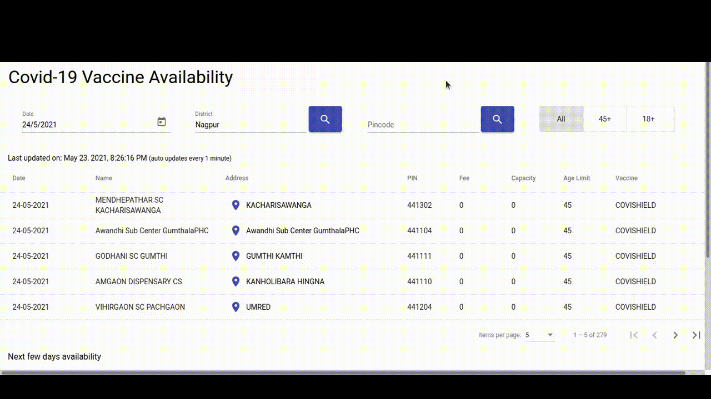

# Covid Vaccine Availability Dashboard

The purpose of this project is to quickly view vaccine availability by district or PIN code. Checking it with [Cowin app](cowin.gov.in) by the government of India can be time taking and cumbersome due to frequent timeouts.

Note: Use this app to view vaccine availability. The actual booking needs to be done by the [Cowin app](cowin.gov.in) 

For more details, view my [blog post](https://pratyakshajha.me/covid-india-vaccine-appointment-availability)

# Installation
- Clone the repository `git clone ` 
- Install dependencies `npm install`
- Run `ng serve`

# Requirements
- NPM
- Angular 12
- Angular Material

# TODO
- [x] Display single day sessions.
- [x] Display multiple days sessions.
- [x] Search by date, district, pincode.
- [x] Filter by age.
- [x] Basic Styling
- [x] Responsiveness / prep for mobile
- [x] Refresh data automatically every minute.
- [ ] Subscribe to updates.

# Angular CLI help
This project was generated with [Angular CLI](https://github.com/angular/angular-cli) version 11.0.5.

## Development server

Run `ng serve` for a dev server. Navigate to `http://localhost:4200/`. The app will automatically reload if you change any of the source files.

## Code scaffolding

Run `ng generate component component-name` to generate a new component. You can also use `ng generate directive|pipe|service|class|guard|interface|enum|module`.

## Build

Run `ng build` to build the project. The build artifacts will be stored in the `dist/` directory. Use the `--prod` flag for a production build.

## Further help

To get more help on the Angular CLI use `ng help` or go check out the [Angular CLI Overview and Command Reference](https://angular.io/cli) page.
